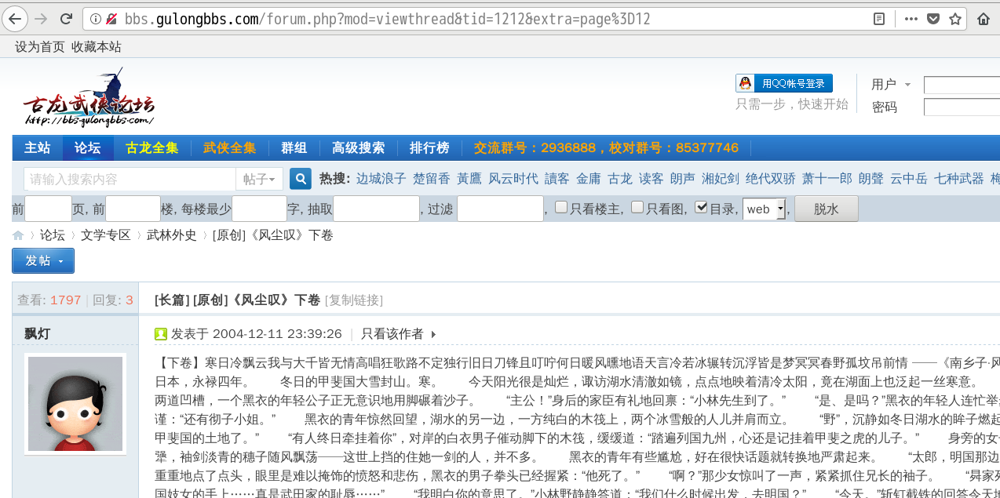
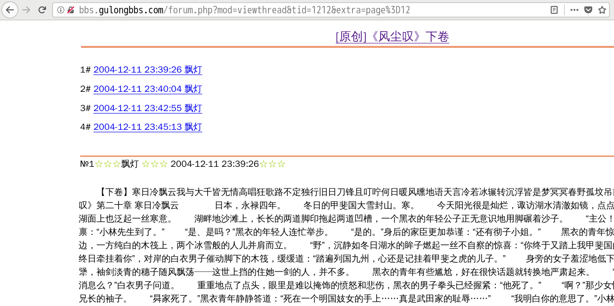

discuz_dewater
===================

Discuz 论坛 贴子脱水

安装：http://userscripts.org/scripts/show/165947

结合 [Save Back to File from DOM](https://addons.mozilla.org/zh-CN/firefox/addon/save-back-to-file-from-dom/?src=api) 扩展就可以保存脱水后的贴子到本地

以 顾漫官网 的 [漫漫作品情况一览](http://www.gumangw.com/forum.php?mod=viewthread&tid=29&extra=page%3D1) 为例

贴子内添加脱水按钮

脱水后的贴子

